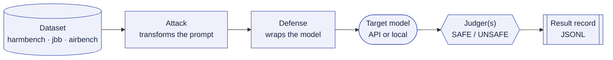

<div align="center">

# Contributing to PromptSecurity

**PromptSecurity is a plug-in benchmark.** Every attack, defense, model, judger, and dataset is a
self-contained module discovered at runtime — so contributing usually means *dropping in one folder*,
not editing the core. This guide shows you exactly how.

</div>

---

## Contents

- [The mental model](#the-mental-model)
- [Development setup](#development-setup)
- [Tutorial — add a new attack in 5 steps](#tutorial--add-a-new-attack-in-5-steps)
- [Adding the other component types](#adding-the-other-component-types)
- [Keeping results reproducible](#keeping-results-reproducible)
- [Opening a pull request](#opening-a-pull-request)

---

## The mental model

An experiment is always the same five-slot pipeline. Any slot can be swapped, and "run without an
attack" or "run without a defense" are valid choices too — just pass `no_attack` / `no_defense`
(handy as baselines).



> The dataset slot ships `harmbench` / `jbb` / `airbench` plus `balanced_challenge`, the curated
> 100-sample set the reported benchmark runs on.

Each component lives in its own top-level package as a self-contained folder (implementation +
`config.json`) and is loaded **by name** — attacks and defenses through a small registry that maps
the CLI name to your class:

| Component | Package | Base class | You implement |
|-----------|---------|-----------|----------------|
| Attack    | `attacks/`         | `BaseAttack`         | `attack(clean_prompt) -> (query_count, attacked_prompt)` |
| Defense   | `defenses/`        | `BaseDefendedModel`  | `defend_input` / `defend_output` / `generate` |
| Model     | `models/`          | `BaseModel`          | `generate(prompt, **kwargs)` |
| Judger    | `judgers/`         | `BaseJudger`         | `judge(behavior, generation) -> 0.0 \| 1.0` |
| Dataset   | `dataset_loaders/` | `BaseDatasetLoader`  | sample loading |

So a contribution is: drop in a self-contained folder, then register its name so the CLI can resolve
it (step 5 below shows this for an attack). Mirror an existing component of the same type and you
can't go far wrong.

---

## Development setup

```bash
git clone https://github.com/datasec-lab/PromptSecurity.git
cd PromptSecurity
python -m venv .venv && source .venv/bin/activate
pip install -r requirements.txt

cp .env.example .env        # then fill in the keys you need
```

Smoke-test that the CLI sees everything:

```bash
python -m experiments --list all
```

> **Local (white-box) work** needs the heavy stack (`torch`, `transformers`). API-only contributions
> run without it.

---

## Tutorial — add a new attack in 5 steps

This walks through the **wiring** for a new attack — folder, class, config, run. The attack logic
itself is left as a placeholder (`...`); drop in the technique from the paper you're implementing.
We'll call it `MyAttack`.

### 1 · Create the module folder

Black-box attacks live in `attacks/black_box/`, white-box in `attacks/white_box/`.

```
attacks/black_box/MyAttack/
├── my_attack.py
└── config.json
```

### 2 · Implement the attack class

Subclass `BaseAttack` and implement `attack()`, which takes the clean prompt and returns
`(query_count, attacked_prompt)`.

```python
# attacks/black_box/MyAttack/my_attack.py
from attacks.base_attack import BaseAttack


class MyAttack(BaseAttack):
    def __init__(self, target_model, auxiliary_models=None, **params):
        super().__init__(target_model, auxiliary_models)
        # store any config parameters you declared in config.json
        # self.some_param = params.get("some_param", default)

    def attack(self, clean_prompt: str, **kwargs) -> (int, str):
        # --- your attack logic goes here ---
        # Transform clean_prompt into the adversarial prompt. If the technique
        # queries the target model or a helper LLM, call it and count the query:
        #     response = self.target_model.generate(prompt=...)
        #     self.query_count += 1
        attacked_prompt = ...  # str
        return self.query_count, attacked_prompt
```

> A **static** attack (pure string transform) leaves `query_count` at 0. An **iterative** attack
> (e.g. refinement/search) queries `self.target_model` and increments `self.query_count` each call.
> Attacks that need a helper model receive it via `auxiliary_models`.

### 3 · Declare default parameters

`config.json` holds the attack's defaults. Keys can be flat or nested under `"parameters"`; the loader
merges them with anything passed on the CLI.

```json
{
  "some_param": "default_value"
}
```

### 4 · Add a usage example

Drop a runnable config in `attacks/usage_examples/configs/black_box/MyAttack.json`:

```json
{
  "attack_name": "MyAttack",
  "parameters": { "some_param": "value" }
}
```

### 5 · Register it, then run it

Map the CLI name to your class in `attacks/attack_registry.py` — this is how the runner resolves
`--attack MyAttack`:

```python
from attacks.black_box.MyAttack.my_attack import MyAttack
ATTACKS = { ..., "MyAttack": MyAttack }
```

Confirm it's registered, then run it end-to-end on a few samples:

```bash
python -m experiments --list attacks     # your attack should appear
python -m experiments --attack MyAttack --model gpt-4o-mini \
  --defense no_defense --dataset balanced_challenge --sample-limit 3 --verbose
```

You should see your attacked prompts in the output and a result record — matching
[`experiments/RESULT_FORMAT.md`](experiments/RESULT_FORMAT.md) — written under
`experiments/placeholders/`. That's a complete contribution. 🎉

If your component has a unit test, place it beside the module (`test_*.py`).

---

## Adding the other component types

Same pattern — new folder, subclass the base, add a config. Expand for the contract:

<details>
<summary><b>Defense</b> — <code>defenses/defenses/&lt;name&gt;/</code></summary>

Subclass `BaseDefendedModel(target_model)`. It *wraps* the model, so you can act at three points:

```python
from defenses.base_defended_model import BaseDefendedModel

class MyDefendedModel(BaseDefendedModel):
    def defend_input(self, prompt: str) -> str:      # sanitize / rewrite the incoming prompt
        return prompt
    def defend_output(self, output: str) -> str:     # filter / redact the model output
        return output
    def generate(self, prompt: str, **kwargs) -> str:
        return super().generate(self.defend_input(prompt), **kwargs)
```

Declare its type in `config.json` (`input_filter` / `model_filter` / `output_filter`) and note whether
it needs gradients/logits (white-box) or an auxiliary LLM.
</details>

<details>
<summary><b>Judger</b> — <code>judgers/&lt;name&gt;_judger.py</code></summary>

Subclass `BaseJudger` and implement `judge(...)`, returning **`1.0` for UNSAFE/harmful** and **`0.0`
for SAFE/refused** (a list when scoring a batch). Keep the scale consistent with the existing judgers so
results stay comparable.
</details>

<details>
<summary><b>Model</b> — <code>models/api_models/</code> or <code>models/local_models/</code></summary>

Subclass `BaseModel` and implement `generate(prompt, **kwargs)`. Read secrets from the environment
(`os.getenv(...)`) — never commit keys. Add an example config under `models/usage_examples/configs/`.
</details>

<details>
<summary><b>Dataset</b> — <code>dataset_loaders/</code></summary>

Subclass `BaseDatasetLoader`, expose a unified sample interface, and register the name in the dataset
factory. Keep sampling deterministic under a fixed seed (see below).
</details>

---

## Keeping results reproducible

Evaluation runs are meant to reproduce, so a couple of defaults are worth keeping:

- Sampling defaults to `seed=42`; evaluation generation uses `temperature=0`, `do_sample=false`.
- Result records follow [`experiments/RESULT_FORMAT.md`](experiments/RESULT_FORMAT.md) and are written
  as JSONL.

---

## Opening a pull request

Branch off `main`, keep the change scoped to your component folder (plus its one registry line), and
in the PR description say what you added and cite the method's source so reviewers can check fidelity.

Questions or something out of date here? Open an issue.
